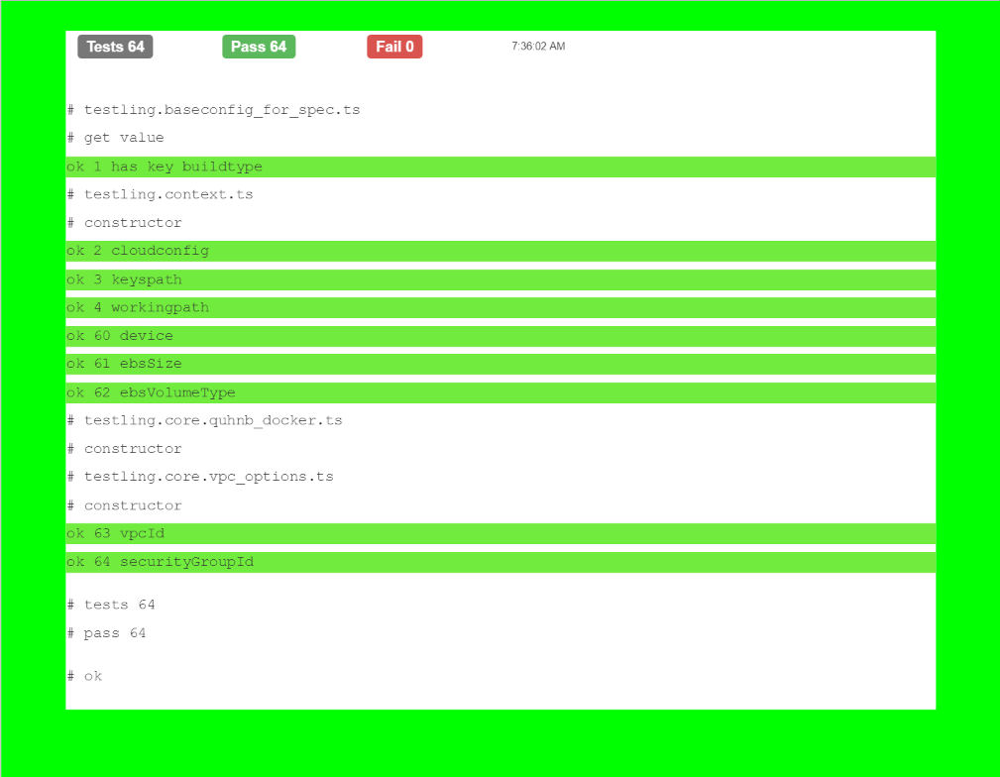
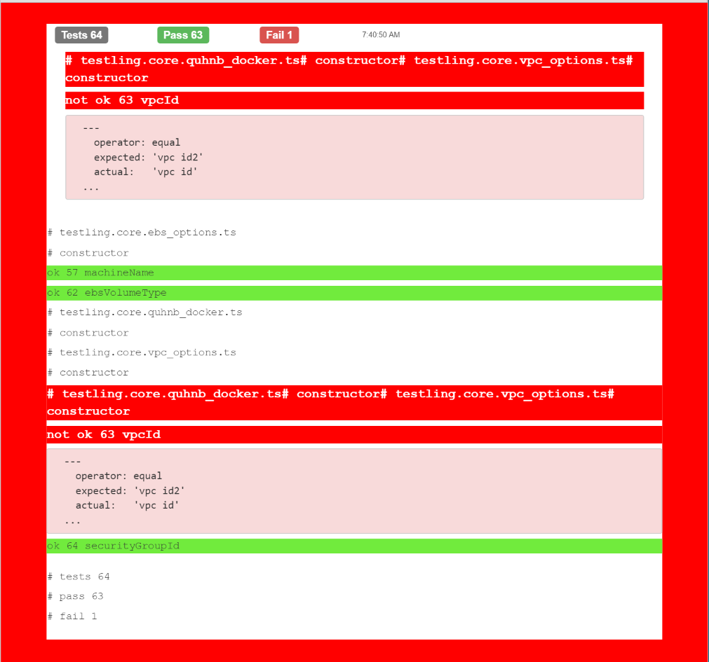

# tap-to-html
A Test-Anything-Protocol (tap) stream transformer to html

[](https://nodei.co/npm/tap-to-html/)
[](https://nodei.co/npm/tap-to-html/)

[![NPM version][npm-image]][npm-url]
[![NPM downloads][downloads-image]][downloads-url]
[![Build status][travis-image]][travis-url]
[![Gitter][gitter-image]][gitter-url]

## Installation

    npm install tap-to-html
    
## Usage

### Javascript

```js
var tapToHtml = new require('tap-to-html').TapToHtml();
var tapToHtmlstream = tapToHtml.stream();

sourceStream.pipe(tapToHtmlstream).pipe(writeStream);
```

### Typescript

```js
import { TapToHtml } from 'tap-to-html';

const tapToHtml = new TapToHtml();

const tapToHtmlstream = tapToHtml.stream();
sourceStream.pipe(tapToHtmlstream).pipe(writeStream);
```

## Example 1

### input

```txt
TAP version 13
# testling.baseconfig_for_spec.ts
# get value
ok 1 has key buildtype
# testling.context.ts
# constructor
ok 2 cloudconfig
ok 3 keyspath
ok 4 workingpath
ok 60 device
ok 61 ebsSize
ok 62 ebsVolumeType
# testling.core.quhnb_docker.ts
# constructor
# testling.core.vpc_options.ts
# constructor
ok 63 vpcId
ok 64 securityGroupId

1..64
# tests 64
# pass  64

# ok
```

### output

```html
<!DOCTYPE html>
<html>
<head>
    <title>Tap To Html</title>
    <link rel="stylesheet" href="bootstrap.min.css">
    <script src="jquery.min.js"></script>
    <script src="bootstrap.min.js"></script>
    <style>
        .error {
            background-color: #ff0000;
            color: #ffffff;
            font-size: 24px;
            font-weight: bold;
        }
        .ok {
            background-color: #71eb3d;
        }
        .errorbody {
            background-color: #ff0000;
        }
        .okbody {
            background-color: #00ff00;
        }
        .container {
            background-color: #ffffff;
            margin-top: 40px;
        }
        h3 {
            font-family: "Times New Roman";
            font-size: 20px;
        }
        p {
            font-family: "Courier New";
            font-size: 20px;
        }
        .yaml {
            background-color: #f8dada;
            font-size: 20px;
        }  
        .toprow {
            height: 10px;
        }  
        .summary {
            margin: 20px;            
        }  
        span.label {
             font-size: 20px;             
        }   
    </style>
    <script>
        $(document).ready(function () {
            setInterval(function () {
                location.reload();
            }, 4000);
        });
    </script>
</head>
<body class="okbody">
    <div class="container">
        <div class="row toprow">
        </div>
        <div class="row">
            <div class="col-md-2">
                <span class="label label-default">Tests 64</span>  
            </div>
            <div class="col-md-2">
                <span class="label label-success">Pass 64</span>                        
            </div>
            <div class="col-md-2">
                <span class="label label-danger">Fail 0</span>
            </div>
            <div class="col-md-6">7:36:02 AM
            </div>
        </div>
        <div class="row summary">
           
        </div>
        <div class="row">
           <br>
<p># testling.baseconfig_for_spec.ts</p>
<p># get value</p>
<p class="ok">ok 1 has key buildtype</p>
<p># testling.context.ts</p>
<p># constructor</p>
<p class="ok">ok 2 cloudconfig</p>
<p class="ok">ok 3 keyspath</p>
<p class="ok">ok 4 workingpath</p>
<p class="ok">ok 60 device</p>
<p class="ok">ok 61 ebsSize</p>
<p class="ok">ok 62 ebsVolumeType</p>
<p># testling.core.quhnb_docker.ts</p>
<p># constructor</p>
<p># testling.core.vpc_options.ts</p>
<p># constructor</p>
<p class="ok">ok 63 vpcId</p>
<p class="ok">ok 64 securityGroupId</p>
<br>
<p># tests 64</p>
<p># pass  64</p>
<br>
<p># ok</p>
<br>
        </div>
    </div>
</body>
</html>
```




## Example 2

### input

```txt
TAP version 13
# testling.core.ebs_options.ts
# constructor
ok 57 machineName
ok 62 ebsVolumeType
# testling.core.quhnb_docker.ts
# constructor
# testling.core.vpc_options.ts
# constructor
not ok 63 vpcId
  ---
    operator: equal
    expected: 'vpc id2'
    actual:   'vpc id'
  ...
ok 64 securityGroupId

1..64
# tests 64
# pass  63
# fail  1
```

### output

```html

<!DOCTYPE html>
<html>
<head>
    <title>Tap To Html</title>
    <link rel="stylesheet" href="bootstrap.min.css">
    <script src="jquery.min.js"></script>
    <script src="bootstrap.min.js"></script>
    <style>
        .error {
            background-color: #ff0000;
            color: #ffffff;
            font-size: 24px;
            font-weight: bold;
        }
        .ok {
            background-color: #71eb3d;
        }
        .errorbody {
            background-color: #ff0000;
        }
        .okbody {
            background-color: #00ff00;
        }
        .container {
            background-color: #ffffff;
            margin-top: 40px;
        }
        h3 {
            font-family: "Times New Roman";
            font-size: 20px;
        }
        p {
            font-family: "Courier New";
            font-size: 20px;
        }
        .yaml {
            background-color: #f8dada;
            font-size: 20px;
        }  
        .toprow {
            height: 10px;
        }  
        .summary {
            margin: 20px;            
        }  
        span.label {
             font-size: 20px;             
        }   
    </style>
    <script>
        $(document).ready(function () {
            setInterval(function () {
                location.reload();
            }, 4000);
        });
    </script>
</head>
<body class="errorbody">
    <div class="container">
        <div class="row toprow">
        </div>
        <div class="row">
            <div class="col-md-2">
                <span class="label label-default">Tests 64</span>  
            </div>
            <div class="col-md-2">
                <span class="label label-success">Pass 63</span>                        
            </div>
            <div class="col-md-2">
                <span class="label label-danger">Fail 1</span>
            </div>
            <div class="col-md-6">7:40:50 AM
            </div>
        </div>
        <div class="row summary">
           <p class="error"># testling.core.quhnb_docker.ts# constructor# testling.core.vpc_options.ts# constructor</p><p class="error">not ok 63 vpcId</p>
<pre class="yaml">
  ---
    operator: equal
    expected: 'vpc id2'
    actual:   'vpc id'
  ...
</pre>
        </div>
        <div class="row">
           <br>
<p># testling.core.ebs_options.ts</p>
<p># constructor</p>
<p class="ok">ok 57 machineName</p>
<p class="ok">ok 62 ebsVolumeType</p>
<p># testling.core.quhnb_docker.ts</p>
<p># constructor</p>
<p># testling.core.vpc_options.ts</p>
<p># constructor</p>
<p class="error"># testling.core.quhnb_docker.ts# constructor# testling.core.vpc_options.ts# constructor</p><p class="error">not ok 63 vpcId</p>
<pre class="yaml">
  ---
    operator: equal
    expected: 'vpc id2'
    actual:   'vpc id'
  ...
</pre>
<p class="ok">ok 64 securityGroupId</p>
<br>
<p># tests 64</p>
<p># pass  63</p>
<p># fail  1</p>
<br>
        </div>
    </div>
</body>
</html>

```



## License

MIT

[npm-image]: https://img.shields.io/npm/v/tap-to-html.svg?style=flat
[npm-url]: https://npmjs.org/package/tap-to-html
[downloads-image]: https://img.shields.io/npm/dm/tap-to-html.svg?style=flat
[downloads-url]: https://npmjs.org/package/tap-to-html
[travis-image]: https://api.travis-ci.org/Quobject/tap-to-html.svg
[travis-url]: https://travis-ci.org/Quobject/tap-to-html/
[gitter-image]: https://badges.gitter.im/Quobject/tap-to-html.svg
[gitter-url]: https://gitter.im/Quobject/tap-to-html?utm_source=badge&utm_medium=badge&utm_campaign=pr-badge